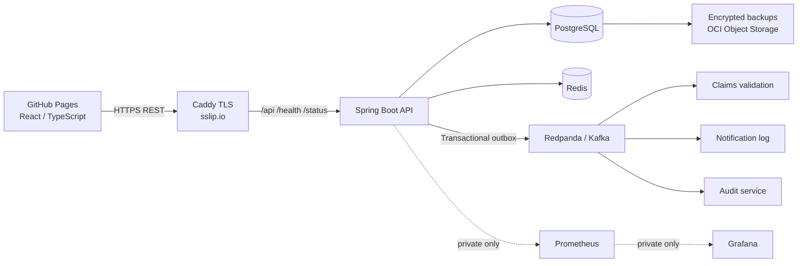

# InsureFlow — Insurance Management System

Modern insurance platform for managing plans, policies, customers, and claims.

The legacy Python/Streamlit app has been replaced with a React frontend, Spring Boot API, PostgreSQL, Redis, and optional Kafka/Redpanda eventing. The live demo runs on **GitHub Pages + Oracle Cloud Always Free**.

## Live demo

| Surface | URL |
| --- | --- |
| Frontend | https://ranjitha-rani.github.io/ims/ |
| API | https://ims.144.24.50.163.sslip.io/api |
| Health | https://ims.144.24.50.163.sslip.io/health |
| Status | https://ims.144.24.50.163.sslip.io/status |

Hard-refresh the frontend (`Cmd/Ctrl + Shift + R`) if an older cached build appears.

### Sample logins

| Role | Email | Password |
| --- | --- | --- |
| Admin | `admin@ims.local` | `ICbWhgw2dJWDn5InKvdhVst` |
| Customer | `priya.sharma@example.com` | `gMk6z9PwMhYMTqH7WGoKTN2U` |

Payments in this demo are **simulated** and do not charge a real card.

## Features

- Customer registration, login, plan browsing, policy purchase, and claim submission
- Admin plan management, customer/policy views, and claim review workflow (review → approve/reject → mark paid) with notes
- JWT auth, role-based access, password change
- Transactional outbox + Kafka/Redpanda consumers for claim validation, notification logging, and audit
- Prometheus/Grafana observability kept private on the VM
- Public aggregate `/status` endpoint only (no metrics or admin surfaces exposed)
- OCI Always Free hosting, Caddy HTTPS via sslip.io, Object Storage backups, budget alerts, and a self-hosted GitHub Actions runner

## Architecture



Public surfaces are limited to the frontend, `/api`, `/health`, and `/status`. Grafana, Prometheus, metrics, and actuator admin paths stay private. Secrets live in the VM `.env` (or AWS Secrets Manager for the optional AWS path) and are never committed.

## Tech stack

| Layer | Choice |
| --- | --- |
| Frontend | React, TypeScript, Vite, GitHub Pages |
| API | Java 21, Spring Boot, Spring Security, JWT |
| Data | PostgreSQL, Flyway, Redis |
| Events | Transactional outbox, Redpanda/Kafka |
| Ops | Docker Compose, Caddy, Prometheus, Grafana |
| Infra | Terraform (OCI Always Free; optional AWS ECS) |
| CI/CD | GitHub Actions |

## Repository layout

```text
frontend/     React client
backend/      Spring Boot API
infra/        AWS + OCI Terraform and runtime assets
observability/ Prometheus + Grafana config
compose*.yaml Local and OCI Compose definitions
docs/adr/     Architecture decision records
```

## Local development

Requirements: Docker Compose v2 and Make.

```sh
make setup
make up
make app
```

Typical local endpoints:

- Frontend: http://localhost:5173
- API: http://localhost:8080/api
- PostgreSQL: `localhost:5432`
- Redis: `localhost:6379`
- Kafka API: `localhost:19092`
- Prometheus: http://localhost:9090
- Grafana: http://localhost:3000

Useful commands: `make config`, `make down`, `make reset`.

Copy `.env.example` / `.env.oci.example` for environment templates. Never commit real secrets.

## Deployment

### Current live path (OCI Always Free)

Documented in [infra/oci/README.md](infra/oci/README.md):

1. Provision networking + ARM VM with Terraform (`us-phoenix-1`)
2. Deploy Compose stack (API, PostgreSQL, Redis, Caddy; optional eventing/observability profiles)
3. Publish frontend to GitHub Pages with `PUBLIC_API_BASE_URL`
4. Keep SSH restricted to your admin IP; prefer the self-hosted runner on the VM for deploys

### Optional AWS path

ECS Fargate + RDS + ALB Terraform lives under `infra/terraform/`. See [infra/README.md](infra/README.md). AWS deploy workflows are manual-only.

## Security notes

- Do not commit `.env`, `.tfvars`, Terraform state, keys, or dumps
- Demo payments record an internal reference only
- Replace sample passwords before any real-user use
- Budget alerts notify if unexpected OCI spend approaches \$1/month
- Backups can upload to a private OCI Object Storage bucket via instance principal

## Architecture decisions

- [ADR 0001: ECS Fargate](docs/adr/0001-ecs-fargate.md)
- [ADR 0002: REST API](docs/adr/0002-rest-api.md)
- [ADR 0003: PostgreSQL](docs/adr/0003-postgresql.md)
- [ADR 0004: Stage Redis and Kafka](docs/adr/0004-stage-redis-kafka.md)
- [ADR 0005: OCI Always Free VM](docs/adr/0005-oci-always-free-vm.md)

## License

This project is provided for portfolio and educational use unless otherwise stated by the repository owner.
